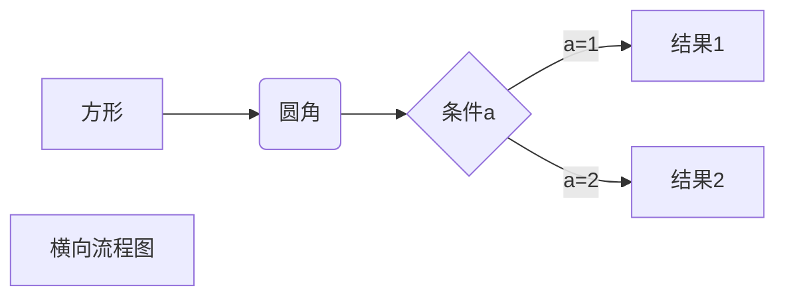
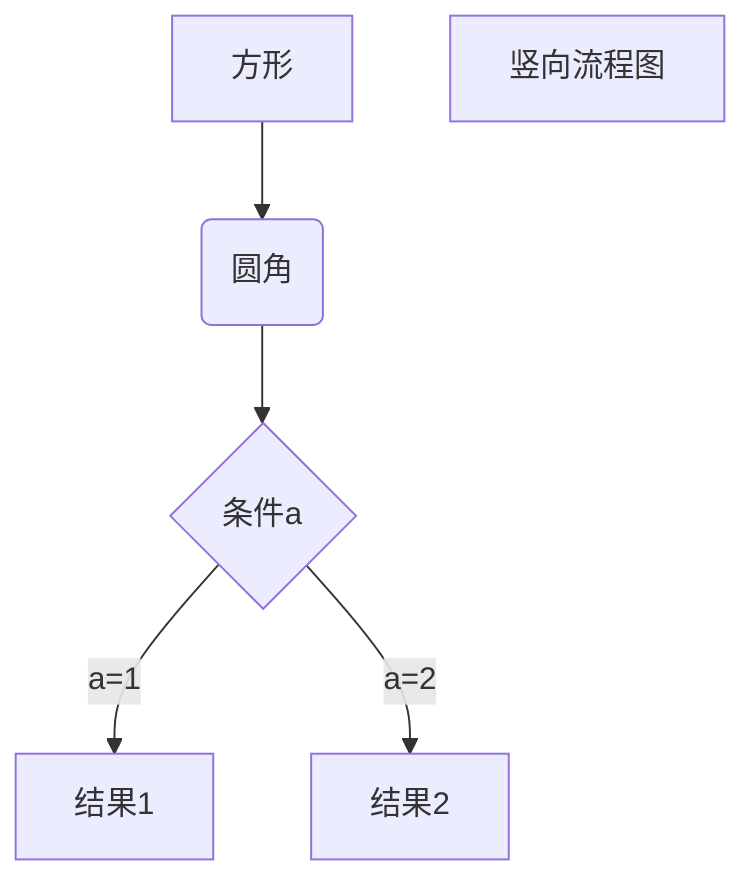
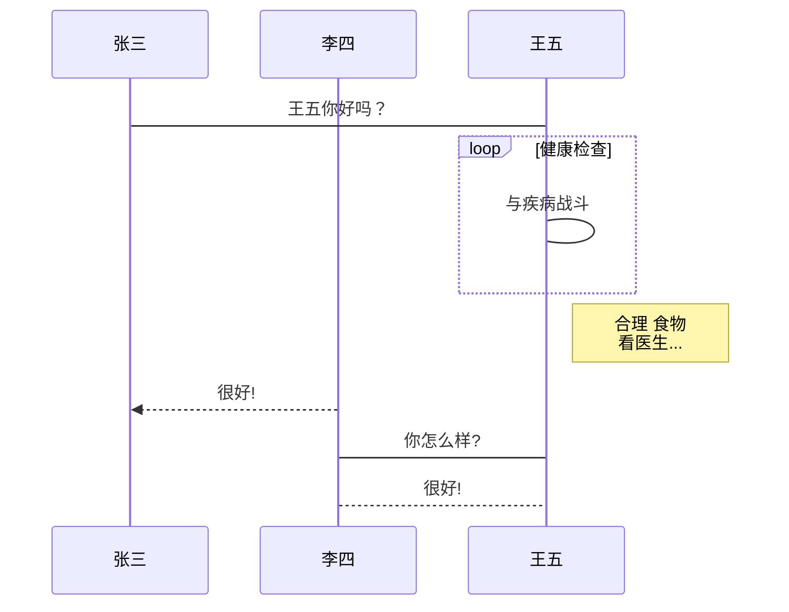
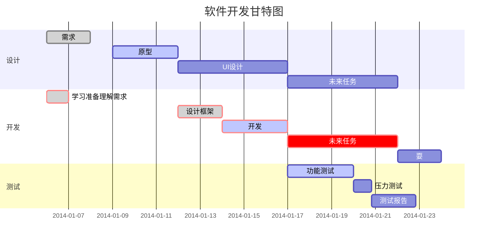

# Markdown学习

## 1.html的标题设置

* h1~h6标题

```html
# h1标题
## h2标题
### h3标题
#### h4标题
##### h5标题
###### h6标题
```

## 自然段改行

```html
 使用两个空格然后再换行
```

## 引用表现

```html
引用：>
```

## 增加分割线

```html
分割线（三个符号）：--- (减号)
                  *** (星号)
                  ___ (下划线)
                  - - - (减号之间加空格)
```

## 强调表现

```html
斜体(前后为一个星或者为一个下划线)：*123*,_123_
粗体(前后为两个星或两个下划线)：**123**,__123__
```

## 列表表示

```html
使用空格可以缩进来展示子列表

列表符号：-  (无序列表)
列表符号：*  (无序列表)
列表符号：+  (无序列表)
列表符号：数字 (有序列表)
```

* 例子：
  1. 第一项
  2. 第二项
     * 子项
     * 子项
  3. 第三项
  4. 第四项
  5. 第五项

## 超文本链接

* 例子
  * [百度知道](http://www.baidu.com)
  * [百度知道](http://www.baidu.com "跳转到百度知道网站")

```html
第一种方式：http://www.baidu.com
第二种方式：<http://www.baidu.com>

第三种方式：[百度知道](http://www.baidu.com)
第四种方式：[百度知道](http://www.baidu.com "跳转到百度知道网站")
```

## 代码高亮显示

* 第一种方式：`
* 第二种方式：~

```html
1.推荐使用开始三个“`”符号然后紧跟代码类型例如c/java/c#/html等
2.使用前后各一个单引号包含的内容可以表示一个代码片段
```

* 展示三个“`”符号

```c++
vector vec = {1,2,3,4};
for(auto i : vec)
{
    cout << i <<",";
}
cout << endl;
```

* 展示一个“`”符号
  * 调用函数 `add(a,b)` 函数处理。

## 图片的引用与显示

```html
语法格式：

```

* 例子：
  * 图片显示：
  * 图片显示并链接跳转： [](https://www.ustc.edu.cn/)

## 表格显示

* 语法只使用`-`和`|`来制作表格
  * 例一：
    |  表头   | 表头   |
    |  ----  |  ----  |
    | 单元格  | 单元格 |
    | 单元格  | 单元格 |
  * 例二表格对齐显示：
    | 左对齐 | 右对齐 | 居中对齐 |
    | :----- | ----: | :----:  |
    | 1  | 2  | 3  |
    | 4  | 5  | 6  |

## 其他高级用法

### 1. 使用反斜杠进行转义

\*\* 正常显示星号 \*\*

### 2.支持HTML元素展示

```html
使用 <kbd>Ctrl</kbd>+<kbd>Alt</kbd>+<kbd>Del</kbd> 重启电脑
```

### 3.支持公式展示

$$
\mathbf{V}_1 \times \mathbf{V}_2 =  \begin{vmatrix} 
\mathbf{i} & \mathbf{j} & \mathbf{k} \\
\frac{\partial X}{\partial u} &  \frac{\partial Y}{\partial u} & 0 \\
\frac{\partial X}{\partial v} &  \frac{\partial Y}{\partial v} & 0 \\
\end{vmatrix}
$$tep1}{\style{visibility:hidden}{(x+1)(x+1)}}
$$

### 4.支持流程图

#### 4.1 横向流程图



#### 4.2 纵向流程图



#### 4.3 纵向标准流程图

```flow
st=>start: 开始框
op=>operation: 处理框
cond=>condition: 判断框(是或否?)
sub1=>subroutine: 子流程
io=>inputoutput: 输入输出框
e=>end: 结束框
st->op->cond
cond(yes)->io->e
cond(no)->sub1(right)->op
```

#### 4.4 横向标准流程图

```flow
st=>start: 开始框
op=>operation: 处理框
cond=>condition: 判断框(是或否?)
sub1=>subroutine: 子流程
io=>inputoutput: 输入输出框
e=>end: 结束框
st(right)->op(right)->cond
cond(yes)->io(bottom)->e
cond(no)->sub1(right)->op
```

#### 4.5 UML时序图源码

```sequence
对象A->对象B: 对象B你好吗?（请求）
Note right of 对象B: 对象B的描述
Note left of 对象A: 对象A的描述(提示)
对象B-->对象A: 我很好(响应)
对象A->对象B: 你真的好吗？
```

#### 4.6 UML时序图源码

```sequence
Title: 标题：复杂使用
对象A->对象B: 对象B你好吗?（请求）
Note right of 对象B: 对象B的描述
Note left of 对象A: 对象A的描述(提示)
对象B-->对象A: 我很好(响应)
对象B->小三: 你好吗
小三-->>对象A: 对象B找我了
对象A->对象B: 你真的好吗？
Note over 小三,对象B: 我们是朋友
participant C
Note right of C: 没人陪我玩
```

#### 4.7 UML标准时序图



#### 4.8 甘特图


